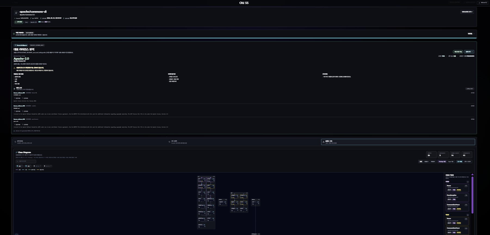
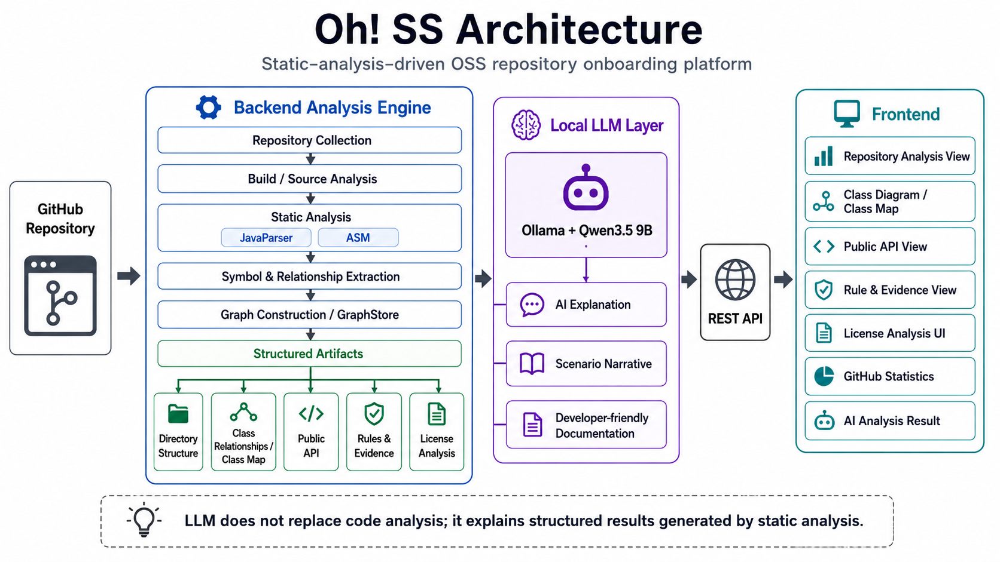

# Oh! SS

> **정적 분석과 로컬 오픈웨이트 LLM을 결합하여 오픈소스 Repository의 구조·Public API·개발 규칙·라이선스와 근거를 자동 분석하는 개발자 온보딩 플랫폼**

Oh! SS는 GitHub Repository를 분석하여 **Repository 구조, 클래스 및 코드 관계, Public API, 개발 규칙, 라이선스 정보와 Evidence**를 구조화하고 시각화합니다.

Repository 전체를 LLM에게 직접 전달해 구조를 추측하도록 하는 대신, **JavaParser·ASM 기반 정적 분석과 Graph 분석을 통해 코드에서 확인 가능한 정보를 먼저 추출**합니다. 이후 구조화된 분석 결과와 Evidence를 **로컬 Ollama 기반 Qwen3.5 9B**가 개발자가 이해하기 쉬운 형태로 설명합니다.

🎥 **Demonstration Video:** https://youtu.be/IeMdvZ4GfUI

<p align="center">
  
</p>

---

## Why Oh! SS?

새로운 오픈소스 프로젝트에 참여하는 개발자는 실제 코드를 수정하기 전에 다음 정보를 파악해야 합니다.

* Repository 및 디렉터리 구조
* 주요 Package·Class·Method
* 클래스 및 코드 요소 사이의 관계
* 외부에 노출되는 Public API
* 프로젝트 내부 개발 규칙
* 적용된 오픈소스 라이선스
* 분석 결과를 뒷받침하는 실제 코드 및 문서 근거

Repository의 규모가 커질수록 이러한 정보를 여러 소스 파일과 문서에서 직접 탐색하는 데 많은 시간이 필요합니다.

Oh! SS는 이러한 초기 탐색 과정을 지원하기 위해 Repository를 정적으로 분석하고, **구조와 개발 맥락을 구조화된 산출물로 생성하여 웹에서 탐색할 수 있도록 제공합니다.**

---

# 주요 기능

## 1. Repository 분석

GitHub Repository URL 또는 `owner/repository` 형식으로 분석을 실행합니다.

* Repository 분석 실행
* 분석 단계별 상태 확인
* 최근 분석 내역 조회
* 기존 Repository 재분석
* 분석 산출물 조회

---

## 2. 코드 구조 탐색

분석된 Repository의 구조를 계층적으로 제공합니다.

* Repository 기본 정보
* Directory
* Package
* Class
* Method
* 코드 요소 간 관계

---

## 3. 클래스 관계 및 서브시스템 분석

추출된 코드 관계를 Graph로 구성하여 클래스 및 서브시스템 구조를 탐색할 수 있도록 합니다.

* Class Diagram
* Class Map
* 코드 요소 간 Relationship
* Subsystem 단위 구조 탐색

Graph 기반 구조 분석에는 **Leiden Network Analysis**를 활용합니다.

---

## 4. Public API 분석

Repository의 Public API 정보를 분석하고 관련 코드 및 근거를 제공합니다.

* Public API 탐색
* 관련 Class / Method
* API 관련 코드 정보
* 관련 Evidence 조회

---

## 5. Rule & Evidence 분석

프로젝트에서 확인되는 개발 규칙과 관련 근거를 분석합니다.

분석 결과만 제공하는 것이 아니라 가능한 경우 해당 판단과 연결되는 **Source File, Code Location, Document Evidence**를 함께 제공합니다.

```text
Analysis Result
      │
      └── Evidence
            ├── Source File
            ├── Code Location
            └── Related Document
```

---

## 6. AI 기반 분석 설명

기본 LLM Runtime은 **Ollama**, 기본 모델은 **Qwen3.5 9B**입니다.

```text
Repository
    ↓
Static Analysis
    ↓
Structured Result / Evidence
    ↓
Ollama + Qwen3.5 9B
    ↓
Developer-oriented Explanation
```

LLM은 Repository의 구조를 대신 생성하는 분석기가 아니라, 앞선 분석 Pipeline에서 생성된 구조화된 결과를 기반으로 설명을 생성하는 계층으로 사용합니다.

Scenario 생성에서도 Backend가 분석 결과를 기반으로 기본 구조를 구성하고, LLM은 해당 구조의 설명을 보완하는 방식으로 분석 결과와 생성 결과의 연결을 유지합니다.

---

## 7. 라이선스 분석

Repository의 오픈소스 라이선스 관련 정보를 분석하고 검토를 지원합니다.

* License 식별
* 주요 License Metric
* Evidence 조회
* Evidence 검색 및 출처 필터
* Review Checklist
* Markdown / JSON Report

> Oh! SS의 라이선스 분석 결과는 법률 자문을 대체하지 않으며, 개발자의 오픈소스 라이선스 검토를 지원하기 위한 정보입니다.

---

## 8. GitHub Repository 통계

GitHub Repository의 활동 정보를 시각화합니다.

* Star 변화
* Issue 활동
* Release 정보
* Repository 주요 지표

---

# Analysis Architecture

Oh! SS는 **정적 분석 → 구조화된 분석 산출물 → LLM 설명** 순서로 Repository를 처리합니다.

<p align="center">
  
</p>

---

# 핵심 기술적 접근

## Static Analysis First

LLM 실행 전에 Repository의 Source 및 Bytecode에서 확인할 수 있는 정보를 먼저 분석합니다.

Java Repository 분석에는 다음 기술을 활용합니다.

* **JavaParser Symbol Solver** — Java Source 및 Symbol 관계 분석
* **ASM** — Java Bytecode 분석

이를 통해 Package, Class, Method, Symbol 및 코드 요소 간 관계를 구조화합니다.

---

## Graph-based Structure Analysis

추출된 Symbol과 Relationship을 Graph 형태로 구성하여 Repository 내부의 구조적 관계를 분석합니다.

Graph 분석 결과는 다음 기능의 기반 데이터로 사용됩니다.

* Class Relationship
* Class Map
* Subsystem Analysis
* Repository Structure Exploration

---

## Evidence-grounded Analysis

분석 결과가 어떤 Source Code 또는 문서에서 도출되었는지 확인할 수 있도록 Evidence 정보를 연결합니다.

이를 통해 사용자가 생성된 결과를 그대로 받아들이는 것이 아니라, **원본 Repository를 기준으로 분석 결과를 다시 확인할 수 있도록 지원합니다.**

---

## Local Open-weight LLM

기본 AI 분석 경로에서는 외부 상용 API가 아닌 **Ollama 기반 로컬 오픈웨이트 모델**을 사용합니다.

```text
Runtime : Ollama
Model   : Qwen3.5 9B
License : Apache-2.0
```

Docker Compose 환경에서는 Ollama와 모델 초기화 서비스를 함께 구성하여 Qwen3.5 9B를 로컬에서 실행합니다.

---

## Reproducible LLM Generation

LLM 생성 설정은 고정 Seed 사용을 지원하여 동일한 입력과 설정에서 출력 변동을 줄일 수 있도록 구성합니다.

Scenario 생성 역시 전체 내용을 LLM이 자유롭게 구성하도록 하지 않고, Backend가 분석 결과를 기반으로 Scenario 구조를 생성한 뒤 모델이 설명을 보완하는 방식으로 구성합니다.

---

# Tech Stack

## Frontend

| 영역                  | 기술                  |
| ------------------- | ------------------- |
| Framework           | React 19            |
| Routing             | React Router DOM 7  |
| Build               | Vite 7              |
| Styling             | Tailwind CSS 4      |
| Graph Visualization | React Flow          |
| Graph Layout        | Dagre               |
| Icons               | Lucide React        |
| Payment             | PortOne Browser SDK |

## Backend

| 영역                | 기술                             |
| ----------------- | ------------------------------ |
| Language          | Java 21                        |
| Framework         | Spring Boot 4                  |
| Database          | PostgreSQL                     |
| ORM               | Spring Data JPA                |
| Query             | QueryDSL                       |
| Static Analysis   | JavaParser Symbol Solver       |
| Bytecode Analysis | ASM                            |
| Graph Analysis    | Leiden Network Analysis        |
| Cache             | Redis                          |
| Storage           | AWS S3                         |
| API Documentation | SpringDoc OpenAPI              |
| Authentication    | Spring Security / OAuth2 / JWT |

## AI

| 영역                | 기술         |
| ----------------- | ---------- |
| Local LLM Runtime | Ollama     |
| Default Model     | Qwen3.5 9B |
| Model License     | Apache-2.0 |

## Infrastructure

* Docker
* Docker Compose
* GitHub Actions
* AWS

---

# Repository

Oh! SS는 Frontend와 Backend를 독립된 Repository로 관리합니다.

## Frontend

**Repository:** https://github.com/Oh-SS-Capston/FE

사용자 인터페이스와 분석 결과 탐색 및 시각화를 담당합니다.

주요 역할:

* Repository 분석 요청
* 분석 진행 상태 확인
* 코드 구조 탐색
* Class Diagram / Class Map
* Public API / Rule / Evidence 조회
* AI 분석 결과 조회
* 라이선스 분석
* GitHub 통계

## Backend / Analysis Engine

**Repository:** https://github.com/Oh-SS-Capston/BE

Repository 분석 Pipeline과 Backend API를 담당합니다.

주요 역할:

* Repository Collection
* Build / Source Analysis
* Static Analysis
* Symbol & Relationship Extraction
* Graph / Cluster Analysis
* Public API Analysis
* Rule & Evidence Analysis
* License Analysis
* LLM Pipeline
* Structured Artifact 관리

---

# Local Development

## Frontend

### Requirements

* Node.js
* npm

```bash
git clone https://github.com/Oh-SS-Capston/FE.git
cd FE

npm ci
npm run dev
```

기본 Backend API 주소:

```text
http://localhost:8080
```

필요한 경우 환경 변수로 변경할 수 있습니다.

```env
VITE_API_BASE_URL=http://localhost:8080
```

Production Build:

```bash
npm run build
```

---

## Backend

### Requirements

* Java 21
* PostgreSQL
* Docker / Docker Compose 권장

```bash
git clone https://github.com/Oh-SS-Capston/BE.git
cd BE
```

### Docker Compose

Docker Compose 환경에서는 다음 서비스를 구성합니다.

* Backend Application
* Redis
* Ollama
* Qwen3.5 9B Model Initialization

```bash
docker compose up --build
```

> PostgreSQL 연결과 Google OAuth, AWS 등 애플리케이션 실행에 필요한 환경 변수는 별도로 구성해야 합니다. 실제 Secret 값은 Repository에 포함하지 않습니다.

기본 Application 주소:

```text
http://localhost:8080
```

Swagger UI:

```text
http://localhost:8080/swagger-ui/index.html
```

### Direct Run

Windows:

```powershell
.\gradlew.bat bootRun
```

macOS / Linux:

```bash
./gradlew bootRun
```

### Test

Windows:

```powershell
.\gradlew.bat clean test
```

macOS / Linux:

```bash
./gradlew clean test
```

---

# Verification

최종 제출 버전은 다음 항목을 기준으로 검증합니다.

### Backend

```bash
./gradlew clean test
./gradlew clean bootJar
```

### Frontend

```bash
npm ci
npm run build
```

### End-to-End

```text
Repository Input
        ↓
Repository Collection
        ↓
Static Analysis
        ↓
Graph / Structure Analysis
        ↓
Public API / Rule / Evidence
        ↓
Ollama + Qwen3.5 9B
        ↓
Structured Analysis Result
        ↓
Frontend Visualization
```

최종 Release 생성 전 위 Pipeline을 실제 공개 Repository를 대상으로 다시 검증합니다.

---

# Known Limitations

현재 구현에서 확인된 주요 제약은 다음과 같습니다.

* 로컬 Qwen3.5 9B의 추론 시간은 CPU·GPU·Memory 등 실행 환경에 따라 크게 달라질 수 있습니다.
* 하나의 LLM Run이 Worker를 장시간 점유하는 경우 후속 Job이 대기할 수 있습니다.
* 일부 Scenario Evidence에서 내부 Evidence ID가 표시되지 않을 수 있습니다.
* Qwen3.5 9B를 로컬에서 실행하기 위해 충분한 Memory가 필요합니다.

이러한 제약은 현재 **LLM 처리 성능 및 일부 Evidence 표현 방식과 관련된 개선 대상**으로 관리하고 있습니다.

---

# Open Source & License

Oh! SS 자체 Source Code는 **Apache License 2.0**으로 배포합니다.

외부 오픈소스 라이브러리, Runtime 및 AI Model은 각 원 저작자의 라이선스를 따릅니다.

| Component  | Role              | License    |
| ---------- | ----------------- | ---------- |
| Ollama     | Local LLM Runtime | MIT        |
| Qwen3.5 9B | Default LLM       | Apache-2.0 |

전체 외부 의존성 정보는 각 Repository에서 확인할 수 있습니다.

* [Frontend THIRD_PARTY_LICENSES.md](https://github.com/Oh-SS-Capston/FE/blob/main/THIRD_PARTY_LICENSES.md)
* [Backend THIRD_PARTY_LICENSES.md](https://github.com/Oh-SS-Capston/BE/blob/main/THIRD_PARTY_LICENSES.md)

---

# Contributing

Oh! SS는 Issue 및 Pull Request 기반으로 개발합니다.

```text
Issue
  ↓
Feature / Fix Branch
  ↓
Implementation
  ↓
Test
  ↓
Pull Request
  ↓
develop
```

각 Repository의 개발 규칙과 세부 구현은 FE / BE README를 참고해주세요.

---

# License

Oh! SS source code is licensed under the **Apache License 2.0**.

Third-party libraries, runtimes, and AI models remain subject to their respective licenses.

For details, see the `LICENSE` and `THIRD_PARTY_LICENSES.md` files in the Frontend and Backend repositories.
